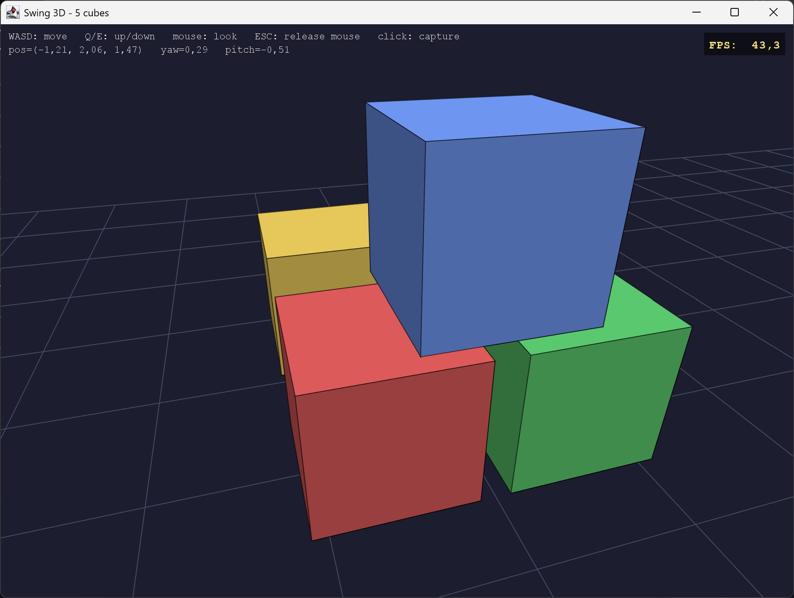

# Swing 3D

This is a simple Java file to demo how to use vanialla Java for 3D. Runs with Java 8+.



## How to run

With older Java:

```
javac Swing3D.java
java Swing3D
```

With modern Java:

```java Swing3D.java```

Add `-x` or `-X` to run in fullscreen. E.g.:

```
java Swing3D.java -X
```

### p.s.:

Press double escape to exit.